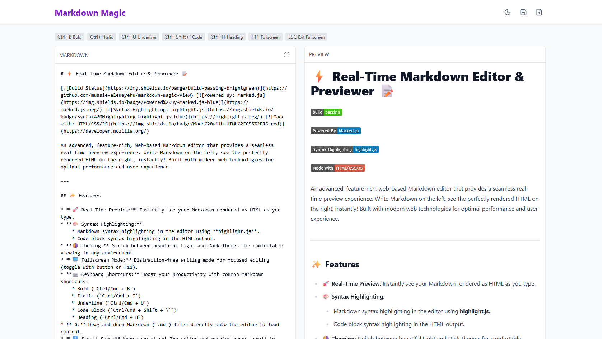
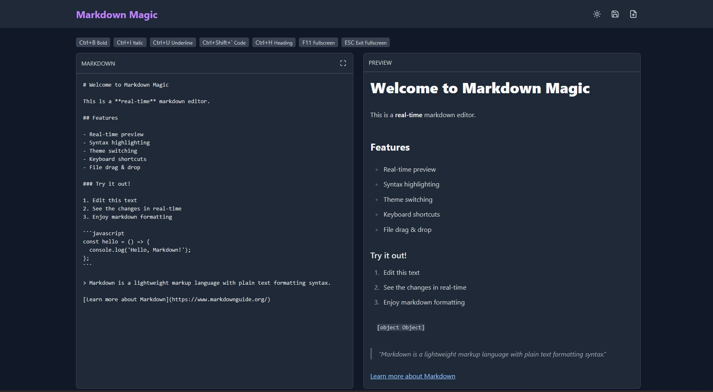
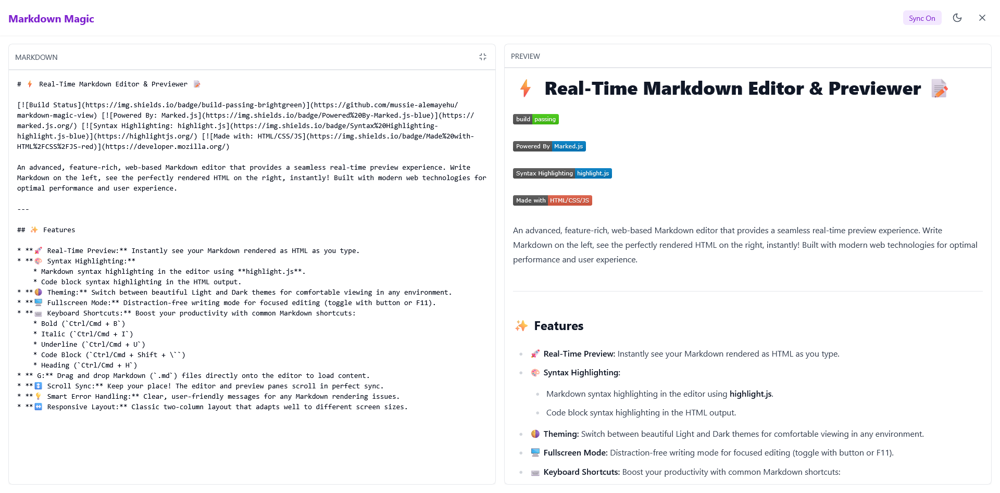

# ⚡ Real-Time Markdown Editor & Previewer 📝

[](https://github.com/mussie-alemayehu/markdown-magic-view)
[](https://marked.js.org/)
[](https://highlightjs.org/) [](https://developer.mozilla.org/)

An advanced, feature-rich, web-based Markdown editor that provides a seamless real-time preview experience. Write Markdown on the left, see the perfectly rendered HTML on the right, instantly! Built with modern web technologies for optimal performance and user experience.

---

## ✨ Features

* **🚀 Real-Time Preview:** Instantly see your Markdown rendered as HTML as you type.
* **🎨 Syntax Highlighting:**
    * Markdown syntax highlighting in the editor using **highlight.js**.
    * Code block syntax highlighting in the HTML output.
* **🌗 Theming:** Switch between beautiful Light and Dark themes for comfortable viewing in any environment.
* **🖥️ Fullscreen Mode:** Distraction-free writing mode for focused editing (toggle with button or F11).
* **⌨️ Keyboard Shortcuts:** Boost your productivity with common Markdown shortcuts:
    * Bold (`Ctrl/Cmd + B`)
    * Italic (`Ctrl/Cmd + I`)
    * Underline (`Ctrl/Cmd + U`)
    * Code Block (`Ctrl/Cmd + Shift + \``)
    * Heading (`Ctrl/Cmd + H`)
* ** G:** Drag and drop Markdown (`.md`) files directly onto the editor to load content.
* **↕️ Scroll Sync:** Keep your place! The editor and preview panes scroll in perfect sync.
* **💡 Smart Error Handling:** Clear, user-friendly messages for any Markdown rendering issues.
* **↔️ Responsive Layout:** Classic two-column layout that adapts well to different screen sizes.

---

## 📸 Screenshots

Here's a glimpse of the editor in action:

**Light Theme:**


**Dark Theme:**


**Fullscreen Mode:**


---

## 🛠️ Tech Stack

* **HTML5:** For the core structure.
* **CSS3:** For styling, layout (Flexbox/Grid), and theming (CSS Variables).
* **JavaScript (ES6+):** For all the dynamic functionality, event handling, and DOM manipulation.
* **[Marked.js](https://marked.js.org/):** For lightning-fast Markdown to HTML conversion.
* **[highlight.js](https://highlightjs.org/):** For beautiful syntax highlighting.

---

## 🚀 Getting Started

**Option 1: Live Demo (Optional)**

* Check out the live version here: [Link to your live demo - e.g., deployed on Vercel/Netlify/GitHub Pages] *(Add this if you deploy it)*

**Option 2: Running Locally**

1.  **Clone the repository:**
    ```bash
    git clone [https://github.com/YOUR_USERNAME/YOUR_REPO.git](https://github.com/YOUR_USERNAME/YOUR_REPO.git)
    cd YOUR_REPO
    ```
2.  **Open the HTML file:**
    Simply open the `index.html` file in your favorite modern web browser (like Chrome, Firefox, Edge, or Safari).

That's it! No complex build steps required for the basic functionality.

---

## ⚙️ How It Works

1.  **Input Listener:** JavaScript listens for the `input` event on the `<textarea>`.
2.  **Markdown Conversion:** On input, the text content is passed to `marked.parse()`.
3.  **HTML Output:** The resulting HTML string updates the `innerHTML` of the output `<div>`.
4.  **Syntax Highlighting:** `hljs.highlightAll()` is typically called after the HTML is updated to apply highlighting to relevant code blocks. Editor highlighting might be handled separately depending on the specific integration method.
5.  **Theming:** CSS variables are defined for colors, fonts, etc. A JavaScript function toggles a class on the `<body>` or root element, which activates the different variable sets for Light/Dark themes.
6.  **Shortcuts:** Keyboard event listeners detect `Ctrl/Cmd` key combinations and manipulate the textarea's selection/value accordingly.
7.  **Drag & Drop:** Event listeners (`dragover`, `drop`) handle file drops, read the `.md` file using the FileReader API, and update the textarea.
8.  **Scroll Sync:** Scroll event listeners on both panes calculate proportional scroll positions and update the `scrollTop` property of the other pane.

---

## ⌨️ Keyboard Shortcuts Reference

| Action        | Windows/Linux        | macOS              |
| :------------ | :------------------- | :----------------- |
| Bold          | `Ctrl + B`           | `Cmd + B`          |
| Italic        | `Ctrl + I`           | `Cmd + I`          |
| Underline     | `Ctrl + U`           | `Cmd + U`          |
| Code Block    | `Ctrl + Shift + \``  | `Cmd + Shift + \`` |
| Heading       | `Ctrl + H`           | `Cmd + H`          |
| Fullscreen    | `F11` (or button)    | `F11` (or button)  |

---

## 🤝 Contributing

Contributions are welcome! If you have suggestions for improvements or find bugs, please feel free to:

1.  Fork the repository.
2.  Create a new branch (`git checkout -b feature/YourAmazingFeature`).
3.  Make your changes.
4.  Commit your changes (`git commit -m 'Add some AmazingFeature'`).
5.  Push to the branch (`git push origin feature/YourAmazingFeature`).
6.  Open a Pull Request.

Please ensure your code follows the existing style and includes comments where necessary.

---

## 🙏 Acknowledgements

* [Marked.js](https://marked.js.org/) team for the excellent Markdown parser.
* [highlight.js](https://highlightjs.org/) contributors for the syntax highlighting capabilities.

---
